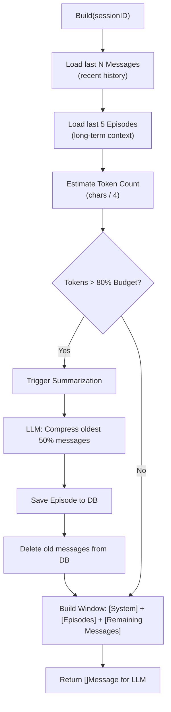

```mermaid
flowchart TD
    Start["Build(sessionID)"] --> LoadRecent["Load last N Messages<br/>(recent history)"]
    LoadRecent --> LoadEpisodes["Load last 5 Episodes<br/>(long-term context)"]
    LoadEpisodes --> Estimate["Estimate Token Count<br/>(chars / 4)"]
    
    Estimate --> CheckThreshold{"Tokens > 80% Budget?"}
    
    CheckThreshold -- Yes --> TriggerSum["Trigger Summarization"]
    TriggerSum --> CompOld["LLM: Compress oldest 50% messages"]
    CompOld --> SaveEp["Save Episode to DB"]
    SaveEp --> DelMsg["Delete old messages from DB"]
    DelMsg --> BuildFinal["Build Window: [System] + [Episodes] + [Remaining Messages]"]
    
    CheckThreshold -- No --> BuildFinal
    
    BuildFinal --> Return["Return []Message for LLM"]
```
