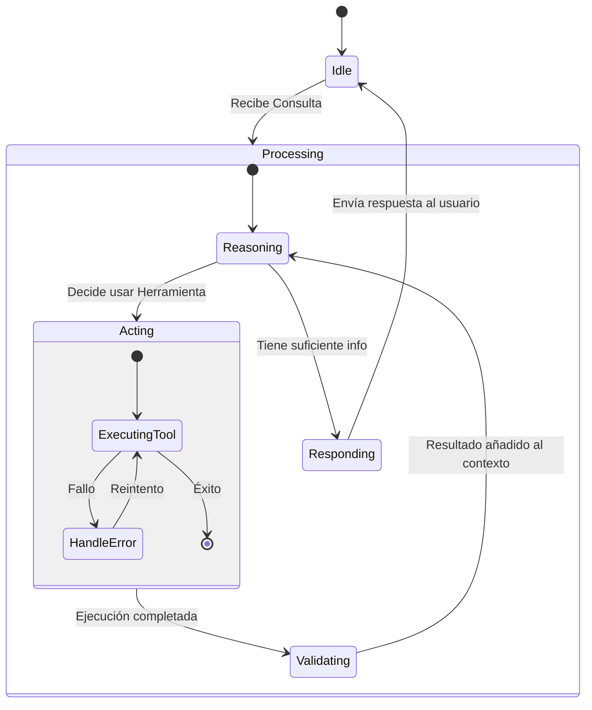

```mermaid
stateDiagram-v2
    [*] --> Idle
    Idle --> Processing : Recibe Consulta

    state Processing {
        [*] --> Reasoning
        Reasoning --> Acting : Decide usar Herramienta
        Reasoning --> Responding : Tiene suficiente info

        Acting --> Validating : Ejecución completada
        Validating --> Reasoning : Resultado añadido al contexto

        state Acting {
            [*] --> ExecutingTool
            ExecutingTool --> HandleError : Fallo
            HandleError --> ExecutingTool : Reintento
            ExecutingTool --> [*] : Éxito
        }
    }

    Responding --> Idle : Envía respuesta al usuario
```
