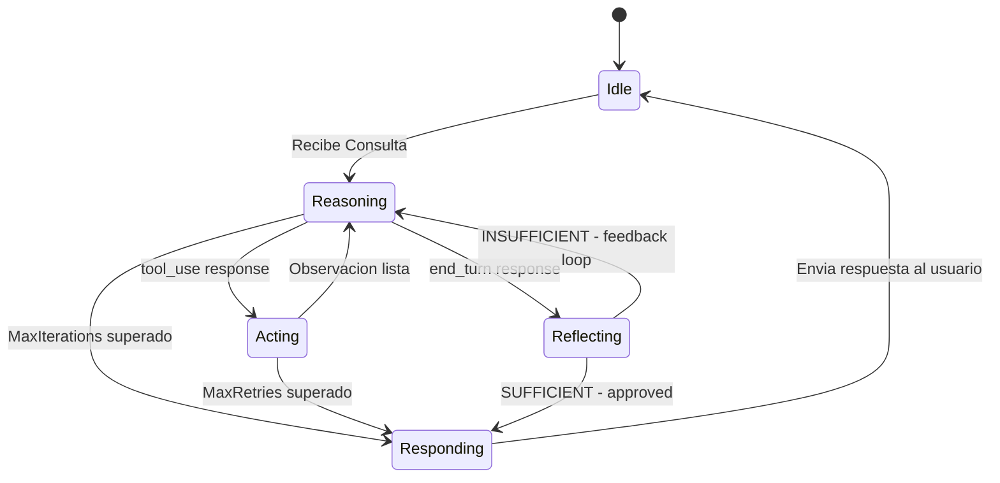

# Agent FSM State Machine

This diagram defines the **Finite State Machine (FSM)** that governs the agent's execution. The FSM enforces deterministic control: the LLM decides *what* to do next, but the code defines *which transitions are valid* in each state.

## Diagram

## State Definitions

| State | Role | Description |
|-------|------|-------------|
| **Idle** | Entry/Exit | Waiting for input. No active work. Session context is not loaded yet. |
| **Reasoning** | Core loop | The LLM is processing the current context window and deciding the next action. Produces either a `tool_use` or `end_turn` response. |
| **Acting** | Execution | The orchestrator executes one or more MCP tool calls requested by the LLM. The LLM is NOT called during this state. |
| **Reflecting** | Quality gate | A lightweight second LLM call (no tools) evaluates the pending answer. Produces `SUFFICIENT` or `INSUFFICIENT`. |
| **Responding** | Output | The final answer is appended to memory and returned to the caller. |

## Transition Logic

| From | To | Trigger | Code location |
|------|----|---------|---------------|
| `Idle` | `Reasoning` | `Run()` called with user input | `orchestrator.go` |
| `Reasoning` | `Acting` | `LLMResponse.StopReason == "tool_use"` | `orchestrator.go` |
| `Reasoning` | `Reflecting` | `LLMResponse.StopReason == "end_turn"` | `orchestrator.go` |
| `Reasoning` | `Responding` | `iterations >= MaxIterations` **(guardrail)** | `orchestrator.go` |
| `Acting` | `Reasoning` | Tool executed (success or error — both become observations) | `orchestrator.go` |
| `Acting` | `Responding` | `retries >= MaxRetries` **(guardrail)** | `orchestrator.go` |
| `Reflecting` | `Reasoning` | Reflection verdict is `INSUFFICIENT` | `orchestrator.go` |
| `Reflecting` | `Responding` | Reflection verdict is `SUFFICIENT` | `orchestrator.go` |
| `Responding` | `Idle` | Answer delivered to caller | `orchestrator.go` |

## Guardrails

Two safety valves prevent infinite loops:

- **`MaxIterations`** (default: 10) — If the Reasoning→Acting cycle repeats beyond this limit, the agent transitions directly to `Responding` with the best available partial answer.
- **`MaxRetries`** (default: 3) — If the same tool fails repeatedly in `Acting`, the agent surfaces the error to the caller instead of retrying indefinitely.

## Key Design Decisions

- **Tool errors do NOT stop the loop.** A failed tool call produces an error observation that is injected back into the context. The LLM can then self-correct (try a different tool, different arguments, or acknowledge the failure).
- **Reflection is cheap.** The `Reflecting` state uses a minimal prompt with no tools, targeting low token usage. It guards against low-quality answers without adding significant latency.
- **All transitions are validated in code.** The `fsm.transition(to State) error` function (see `fsm.go`) rejects invalid transitions at runtime, preventing the orchestrator from reaching illegal states.
