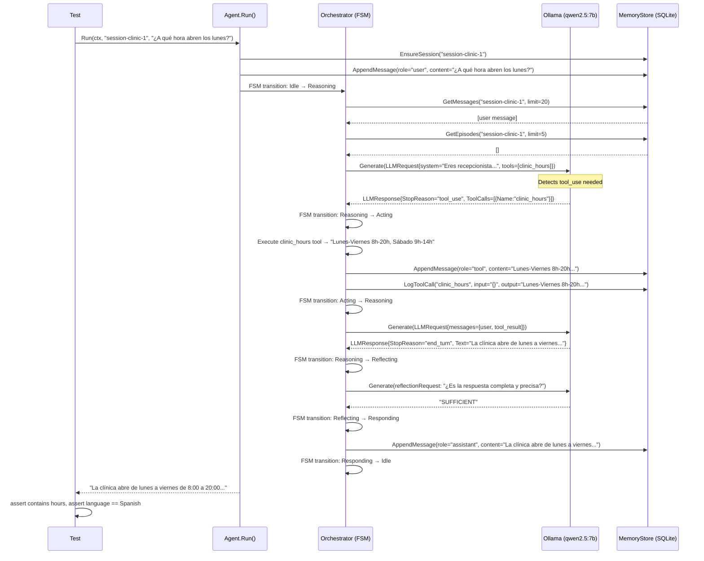
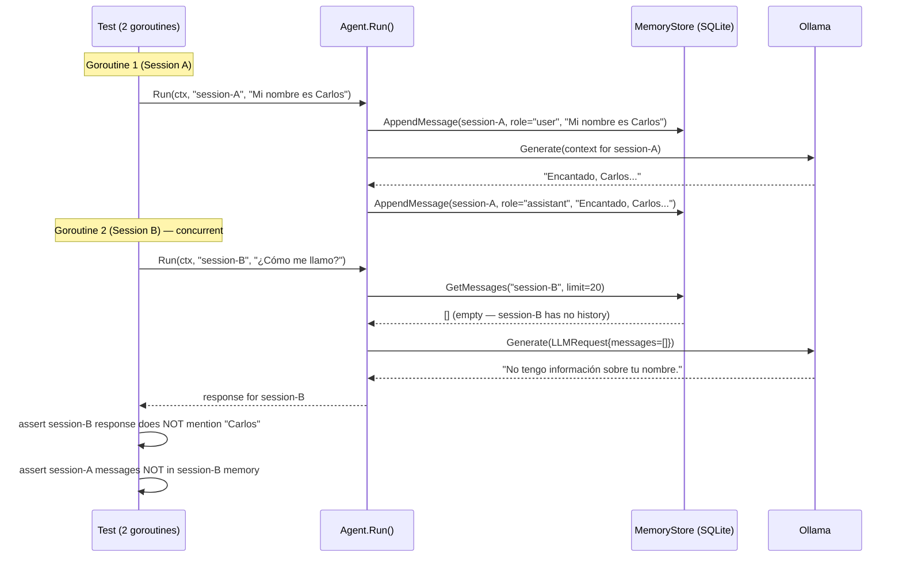

# Integration Test Scenario: Clinic Assistant

This diagram documents the flow covered by the `//go:build integration` tests in `integration_test.go`.
These tests require **Ollama** running locally with `qwen2.5:7b`.

Linked from: [IMPLEMENTATION.md, section 7](../IMPLEMENTATION.md) · [README.md](../../README.md)

---

## Scenario 1: Clinic Hours Query (`TestIntegration_ClinicHours`)

---

## Scenario 2: Session Isolation (`TestIntegration_SessionIsolation`)

---

## Diagram Coverage

| FSM States Exercised | Source |
|----------------------|--------|
| Idle → Reasoning | Both scenarios |
| Reasoning → Acting | Scenario 1 (tool_use) |
| Acting → Reasoning | Scenario 1 |
| Reasoning → Reflecting | Scenario 1 |
| Reflecting → Responding | Scenario 1 |
| Responding → Idle | Scenario 1 |
| Memory isolation | Scenario 2 |

> These integration tests complement (not replace) the DDT unit tests that use mock LLMs.
> They verify real LLM behavior and end-to-end memory isolation with a live Ollama instance.
