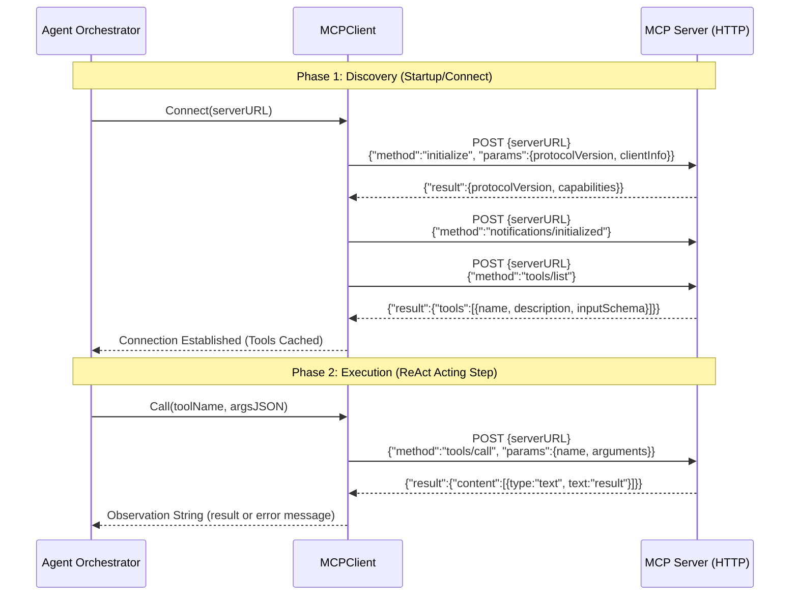

```mermaid
sequenceDiagram
    participant O as Agent Orchestrator
    participant C as MCPClient
    participant S as MCP Server (HTTP)

    Note over O,S: Phase 1: Discovery (Startup/Connect)
    O->>C: Connect(serverURL)
    C->>S: POST {serverURL}<br/>{"method":"initialize", "params":{protocolVersion, clientInfo}}
    S-->>C: {"result":{protocolVersion, capabilities}}
    C->>S: POST {serverURL}<br/>{"method":"notifications/initialized"}
    C->>S: POST {serverURL}<br/>{"method":"tools/list"}
    S-->>C: {"result":{"tools":[{name, description, inputSchema}]}}
    C-->>O: Connection Established (Tools Cached)

    Note over O,S: Phase 2: Execution (ReAct Acting Step)
    O->>C: Call(toolName, argsJSON)
    C->>S: POST {serverURL}<br/>{"method":"tools/call", "params":{name, arguments}}
    S-->>C: {"result":{"content":[{type:"text", text:"result"}]}}
    C-->>O: Observation String (result or error message)
```
