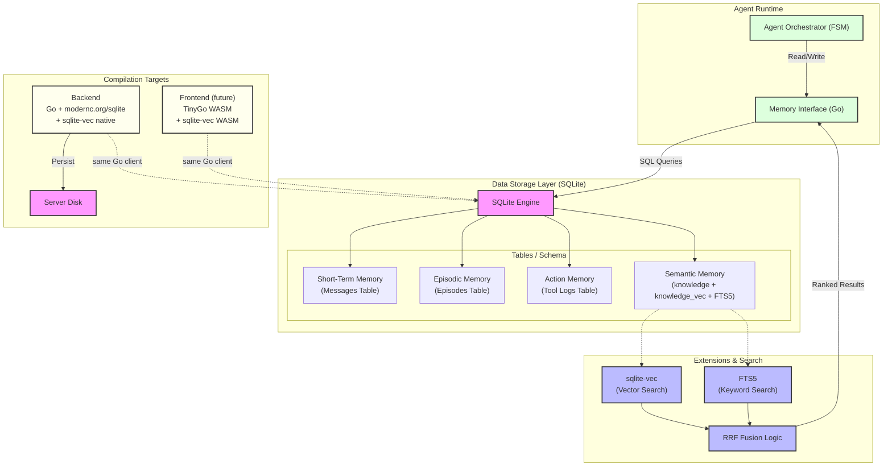

# Agent Memory Architecture Diagram

This diagram visualizes the unified SQLite-based memory system for the `tinywasm/agent`, highlighting the isomorphic consistency between Backend and Frontend. Both environments use the same Go client, same SQL schema, and the same `sqlite-vec` extension — only the compilation target differs.

