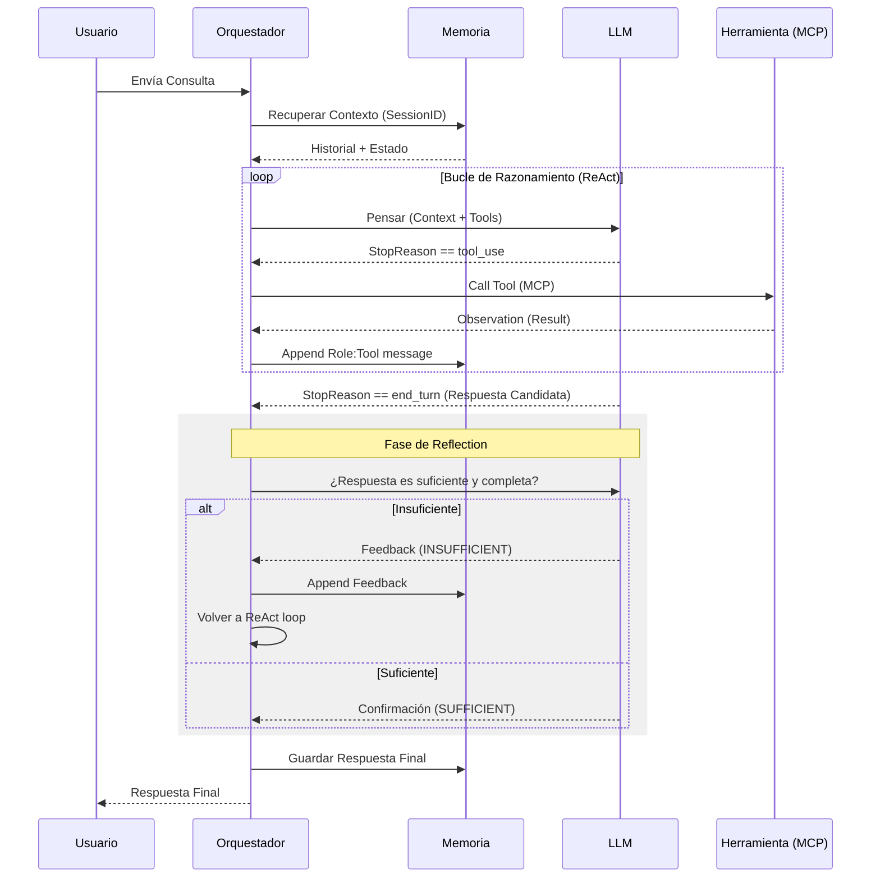

```mermaid
sequenceDiagram
    participant U as Usuario
    participant O as Orquestador
    participant M as Memoria
    participant L as LLM
    participant T as Herramienta (MCP)

    U->>O: Envía Consulta
    O->>M: Recuperar Contexto (SessionID)
    M-->>O: Historial + Estado

    loop Bucle de Razonamiento (ReAct)
        O->>L: Pensar (Context + Tools)
        L-->>O: StopReason == tool_use

        O->>T: Call Tool (MCP)
        T-->>O: Observation (Result)
        O->>M: Append Role:Tool message
    end

    L-->>O: StopReason == end_turn (Respuesta Candidata)

    rect rgb(240, 240, 240)
    Note over O,L: Fase de Reflection
    O->>L: ¿Respuesta es suficiente y completa?
    alt Insuficiente
        L-->>O: Feedback (INSUFFICIENT)
        O->>M: Append Feedback
        O->>O: Volver a ReAct loop
    else Suficiente
        L-->>O: Confirmación (SUFFICIENT)
    end
    end

    O->>M: Guardar Respuesta Final
    O-->>U: Respuesta Final
```
