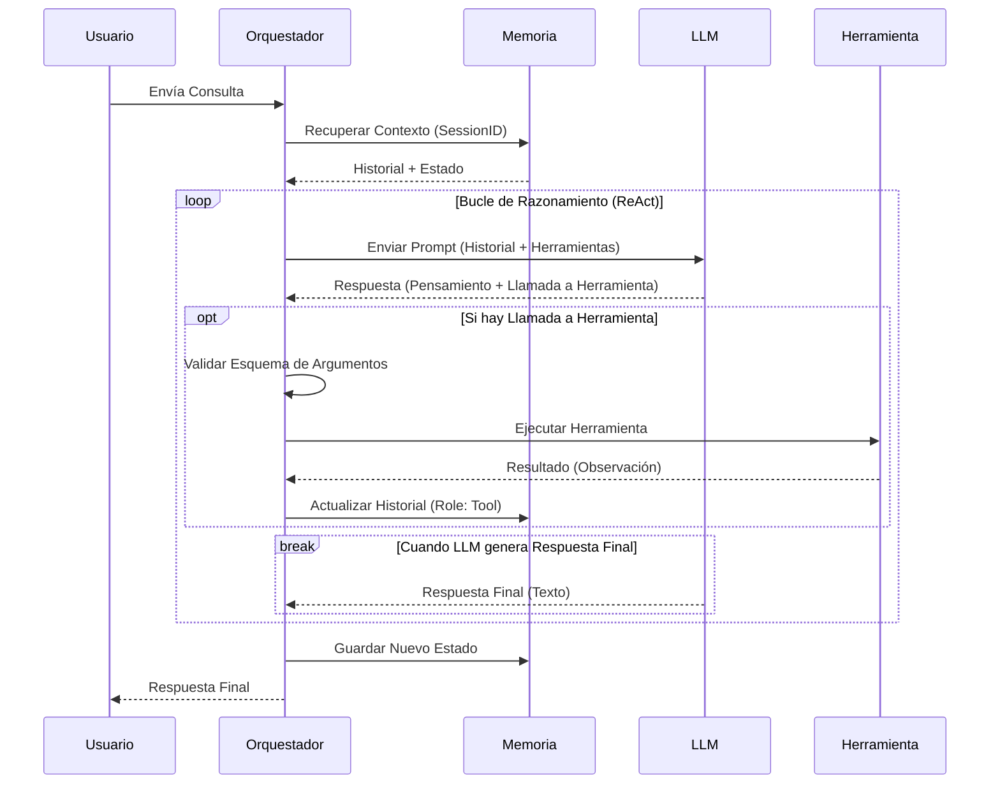

```mermaid
sequenceDiagram
    participant U as Usuario
    participant O as Orquestador
    participant M as Memoria
    participant L as LLM
    participant T as Herramienta

    U->>O: Envía Consulta
    O->>M: Recuperar Contexto (SessionID)
    M-->>O: Historial + Estado

    loop Bucle de Razonamiento (ReAct)
        O->>L: Enviar Prompt (Historial + Herramientas)
        L-->>O: Respuesta (Pensamiento + Llamada a Herramienta)

        opt Si hay Llamada a Herramienta
            O->>O: Validar Esquema de Argumentos
            O->>T: Ejecutar Herramienta
            T-->>O: Resultado (Observación)
            O->>M: Actualizar Historial (Role: Tool)
        end

        break Cuando LLM genera Respuesta Final
            L-->>O: Respuesta Final (Texto)
        end
    end

    O->>M: Guardar Nuevo Estado
    O-->>U: Respuesta Final
```
