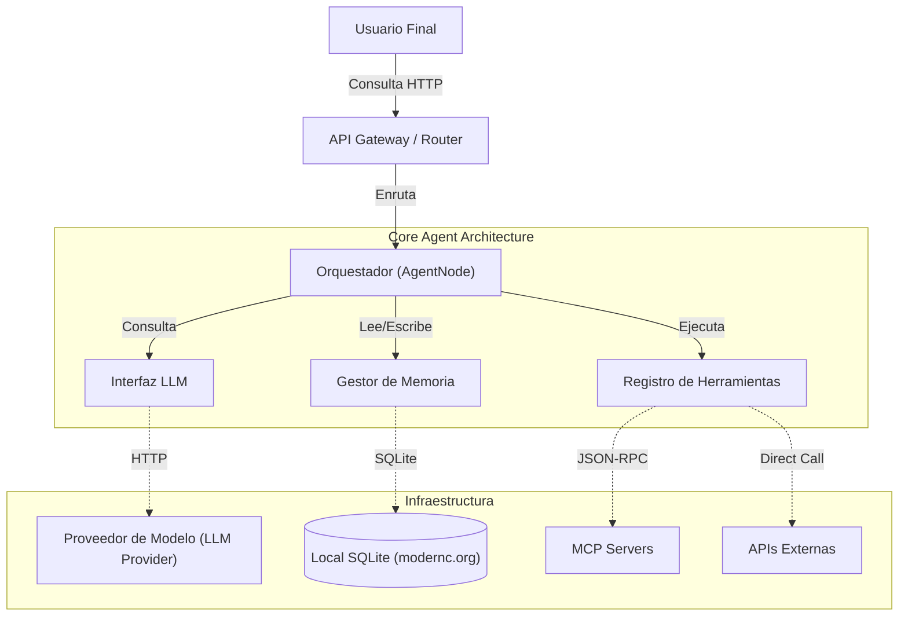

```mermaid
graph TD
    User["Usuario Final"] -->|Consulta HTTP| API["API Gateway / Router"]
    API -->|Enruta| Orchestrator["Orquestador (AgentNode)"]

    subgraph "Core Agent Architecture"
        Orchestrator -->|Consulta| LLM["Interfaz LLM"]
        Orchestrator -->|Lee/Escribe| Memory["Gestor de Memoria"]
        Orchestrator -->|Ejecuta| Tools["Registro de Herramientas"]
    end

    subgraph "Infraestructura"
        LLM -.->|HTTP| Provider["Proveedor de Modelo (LLM Provider)"]
        Memory -.->|SQLite| DB[("Local SQLite (modernc.org)")]
        Tools -.->|JSON-RPC| MCPServers["MCP Servers"]
        Tools -.->|Direct Call| ExternalAPIs["APIs Externas"]
    end
```
